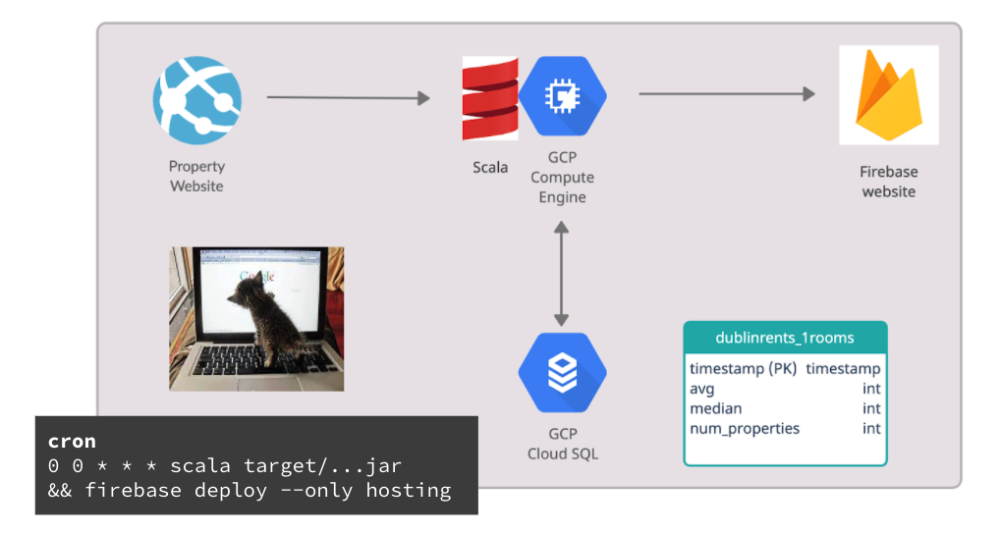

[](https://travis-ci.com/pdywilson/rentcrawler)
[](https://codecov.io/gh/pdywilson/rentcrawler)


# Rentcrawler
## A minimal example of deploying a data pipeline

*Update: This is an updated version of my project. Initially I used Python and the code took about ~4 minutes to run, now with Scala and Asynchronous + Parallel programming it runs in ~30 seconds.*

Almost one year into quarantine here in Dublin I was wondering whether the notoriously high rent prices in Dublin might actually be going down at the moment. To investigate this I wanted to set up a data processing pipeline that automatically updates a webpage with the current status of monthly rent prices in Dublin, all while trying out google compute cloud & firebase.

So the first step was to get data on the monthly rents in Dublin. All I found in terms of datasets was the RTB Average Rent Dataset https://www.rtb.ie/research/average-rent-dataset. This dataset gives the average rents for each of Dublin's districts at a quarterly basis. With the last update being Q3-2020 this wasn't up-to-date enough for me, I wanted a more current status of the housing market. So the next idea I had was to crawl a rental property website for a more current status on the rents.

The architecture looked something like this. 



(This diagram was created with creately.com)

I used GCP for deploying my scala code, GCP Cloud SQL as the database, Firebase to deploy the website and cron for automation of running the program and deploying the website.

The details of the program are explained in the following four parts: Scraping, Database, Deployment and Automation.

## Part 1. Scraping
For this task I used the package `scala-scraper`, which includes the `JsoupBrowser`.
```
  /**
   * For given url retrieve all Rent prices on that page by matching the Regex.
   */
    def processOneUrl(url: String) = Future[List[Int]] {
      val numberPattern: Regex = "€.{1,9}per month".r
      val browser = JsoupBrowser()
      val oneUrl = browser.get(url)
      val candidates = oneUrl >> elementList("span")
      val candidatesAsString = candidates.map(_ >> allText("span"))
      val rentList = 
        candidatesAsString
          .map(elt => numberPattern.findAllMatchIn(elt))
          .flatten
          .map(d => d.toString.dropRight(10).drop(1).replace(",","").toInt)
      rentList
     } recover {case _ => List[Int]()}
```

This will give me a list of everything that looks like the regular expression '€.*per month' on the webpage. The search is based on the html code that is pulled from the url in which I specify my search on apartments for rent in Dublin-City with maximum number of beds of 2. The maximum amount of apartments shown on one page rental property website is 20 so I go through the list of apartments in increments of 20 with a for loop. The result is a list of Integers that I can use to calculate the mean and median.

## Part 2. Database
I was thinking it might be good practice to store this in a database using a seperate cloud instance, here I used Cloud SQL.

```
    /**
    * Updates SQL Database with timestamp, avg, median, number_of_properties.
    */
    def writeToDB(table: String, stats: Vector[Int])(implicit session: scalikejdbc.AutoSession.type) = {
        val currentTimestamp = new java.sql.Timestamp(System.currentTimeMillis())
        val tableName = SQLSyntax.createUnsafely(table)
        sql"""insert into ${tableName} values(${currentTimestamp},${stats(0)},${stats(1)},${stats(2)})""".execute.apply()
    }

    /**
    * Get latest data from database (timestamp, avg, median, number_of_properties).
    */
    def selectFromDB(table: String)(implicit session: scalikejdbc.AutoSession.type) = {
        val tableName = SQLSyntax.createUnsafely(table)
        val latestData = sql"""select * from ${tableName} order by timestamp desc limit 1""".map(_.toMap).list.apply()
        latestData(0)
    }
```

This saves a timestamp together with the mean, median and number of properties used to calculate for each of the categories (1-bedroon, 2-bedroom, etc.).

> Don't upload sensitive information such as passwords to GitHub! I need to access the CloudSQL database through my Scala code (which I upload to github). This involves using an IP address as well as a DB username and password. The Solution: Use a `.config` file that is not tracked in github that contains the password and read the password from the file with code. See following code:

```
    // ad-hoc session provider on the REPL
    implicit val session = AutoSession
    Class.forName("org.postgresql.Driver")
    val config = scala.io.Source.fromFile(".config").getLines
    ConnectionPool.singleton(config.next().toString, config.next().toString, config.next().toString)
```

Now that the database is set up, we can move on to deploying the application.

## Part 3. Building

To run the code, I compiled it with `sbt assembly` and then was able to run it with `scala target/...jar`. But instead, we can also containerize the application for easier portability.

### Containerization
Instead of building with assembly to create a jar, we can easily create a docker container and run that instead.

Basically we need to add 
```
addSbtPlugin("com.typesafe.sbt" % "sbt-native-packager" % "1.3.6")
```
to project/plugin.sbt, and 
```
enablePlugins(JavaAppPackaging)
```
to build.sbt. This enables us to use 'sbt stage' and run our app. If we have docker installed, we can then run `sbt docker:stage` to stage it and `sbt docker:publishLocal` to create the image. Run the image as usual per `docker run <image>`. 


Some commands for docker clean up:

```
docker container stop $(docker container ls –aq)
```
```
docker container rm $(docker container ls –aq)
```

Find more details on this in my [blogpost](https://pdywilson.github.io/posts/10_Containerizing_my_Scala_scraper).

## Part 4. Deployment
First we configure a VM instance (Virtual Machine) on Google Compute Cloud. I went with e2-medium (2 vCPUs, 4 GB memory), the standard debian image and a zone in europe which is where I live. I also activated HTTP and HTTPS traffic. Clicking on the SSH button opens up a terminal in the browser and we can go ahead and pull our Scala code onto it from github. 


As mentioned above, I am using Firebase for deploying the website and here I just followed the Get-Started-Guide at https://firebase.google.com/docs/hosting/quickstart. This quick start guide deploys a website at *projectname*.web.app showing the contents of an index.html file on my VM instance. All that's left to do is populate this index.html file. To do this, I simply output an index.html file with scala using a long string.

```
 /**
   * Updates the html file used for the website.
   *
   * First queries the database for latest results.
   * Then writes a html-String to the file.
   */
  def updateWebsite()(implicit session: scalikejdbc.AutoSession.type) = {
    val stats1 = selectFromDB("dublinrents_1rooms")
    val stats2 = selectFromDB("dublinrents_2rooms")
    val stats3 = selectFromDB("dublinrents_3rooms")
    val stats4 = selectFromDB("dublinrents_4rooms")

    val website = s"""<!DOCTYPE html>
        <html>
        <style>
        .content {
        max-width: 500px;
        margin: auto;
        text-align: center;
        }
        </style>
        <head>
            <meta charset="utf-8">
            <meta name="viewport" content="width=device-width, initial-scale=1">
            <title>Dublin Rents</title>
        </head>
        <body>
        <div class="content">
            <div>
            <h2>Average Monthly Rent in Dublin</h2>
            <h1>Rents are on 🔥</h1>
            </div>
            <div>
            <h2>1-bedroom</h2>
            <p>The average rent is: €${stats1("avg")}</p>
            <p>The median rent is: €${stats1("median")}</p>
            <p>(Based on ${stats1("number_of_properties")} 1-bedroom Dublin-City properties)</p>
            </div>
            <div>
            <h2>2-bedroom</h2>
            <p>The average rent is: €${stats2("avg")}</p>
            <p>The median rent is: €${stats2("median")}</p>
            <p>(Based on ${stats2("number_of_properties")} 2-bedroom Dublin-City properties)</p>
            </div>
            <div>
            <h2>3-bedroom</h2>
            <p>The average rent is: €${stats3("avg")}</p>
            <p>The median rent is: €${stats3("median")}</p>
            <p>(Based on ${stats3("number_of_properties")} 3-bedroom Dublin-City properties)</p>
            </div>
            <div>
            <h2>4-bedroom</h2>
            <p>The average rent is: €${stats4("avg")}</p>
            <p>The median rent is: €${stats4("median")}</p>
            <p>(Based on ${stats4("number_of_properties")} 4+-bedroom Dublin-City properties)</p>
            </div>
            <div>
            <p>Last updated: ${stats1("timestamp")}</p>
            </div>

        </body>
        </html>"""
```

This function fetches the latest results from the SQL database and then populates the HTML string with the newest numbers on monthly rents in Dublin. The index.html file is then updated with the HTML string.

## Part 5. Automation

To automate it I set up a cron job to run it every 24 hours. This is done by editing the crontab with `crontab -e` on the VM.

```
PATH="/home/pdywilson/.sdkman/candidates/java/current/bin:/home/pdywilson/.sdkman/candidates/scala/current/bin:/usr/local/bin:/usr/bin:/bin"
0 0 * * * cd /home/pdywilson/rentcrawler/scala && scala target/scala-2.13/posty-assembly-0.1.0-SNAPSHOT.jar && cd /home/pdywilson/rentmanhost && firebase deploy --only hosting >> ~/cron.log 2>&1
```

Note that I set the PATH here to make scala callable for the cron service. I also rerouted the output as well as the error output to `~/cron.log` so that I can check if it worked or what the error message says if it doesn't with `cat ~/cron.log`.

That's it! We can now open [https://rentmanhost.web.app/](https://rentmanhost.web.app/) in the browser and check out the newest numbers on monthly rent in Dublin.

## Summary

Today we had a look at a small example of deploying a data pipeline that automatically crawls the web for data, updates a SQL database, calculates simple stats and publishes the results onto a website. 

1. We used Scala and the library `scala-scraper` to scrape the web for data.
2. We used Google Cloud SQL to store our data into a persistent database.
3. We used Google Compute Engine to deploy our `containerized` application.
4. We used Firebase to host a website.
5. We used cron to for automation of tasks.

## Next steps

1. Using cron is a bit fiddly, so I'd like to replace it with the scheduling framework `airflow`. 
2. Our data crawler might still be optimized using a distributed framework such as `Apache Nutch` for crawling.

All in all I'm happy with how this toy project went, I'm especially happy about using Scala. Thanks for reading! :)